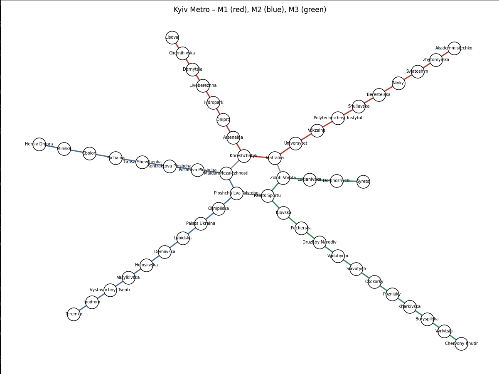

# Домашнє завдання — Графи метро (Завдання 2)

## Стислі висновки

- **Akademmistechko → Lisova** — обидва алгоритми дали той самий ланцюжок (17 ребер). Весь шлях іде однією червоною лінією без альтернативних гілок.
- **Heroiv Dnipra → Lisova** — DFS довший (19), BFS коротший (15). DFS пішов через *Palats Sportu → Zoloti Vorota*, тоді як BFS вибрав коротшу пересадку *Maidan ↔ Khreshchatyk*.
- **Syrets → Teremky** — обидва дали однаковий шлях (14 ребер). Єдиний мінімальний перехід — *Palats Sportu ↔ Ploshcha Lva Tolstoho*.

## Візуалізація графа

